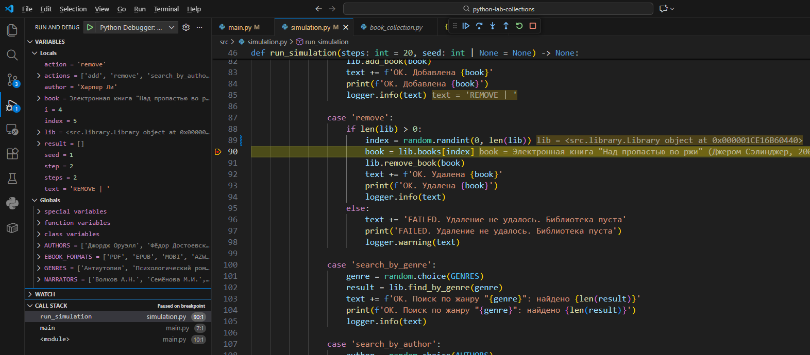
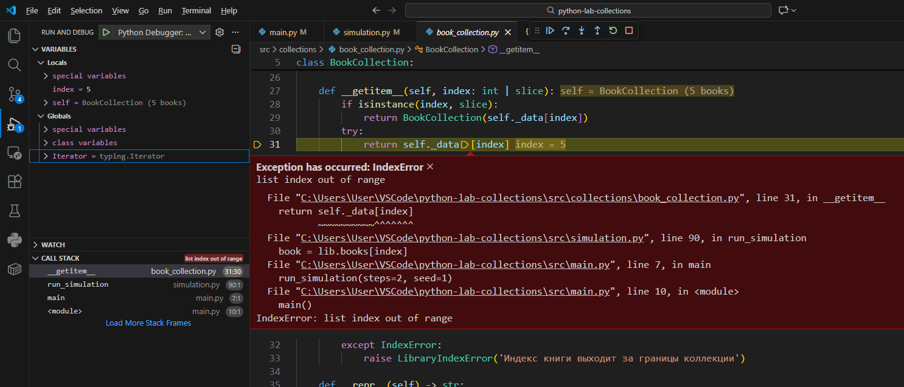
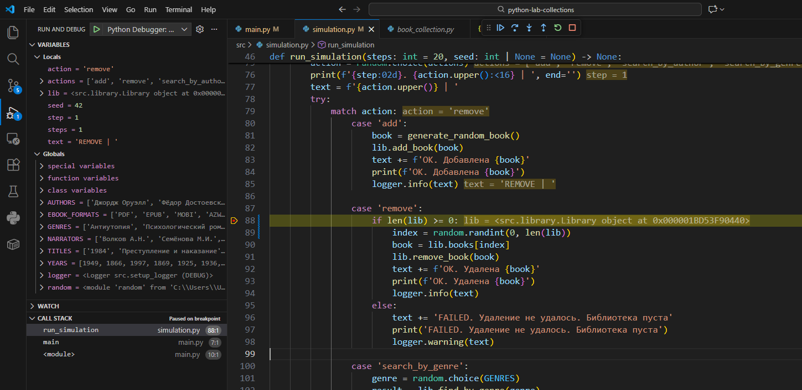
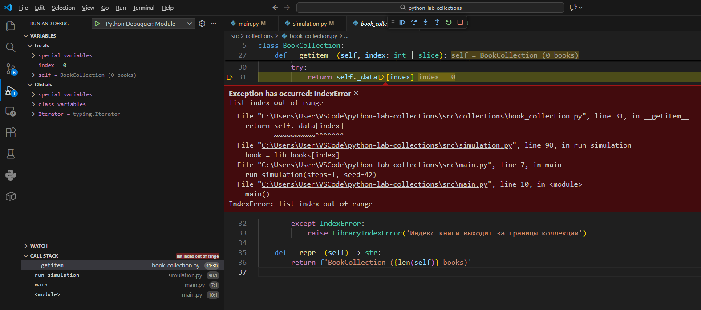
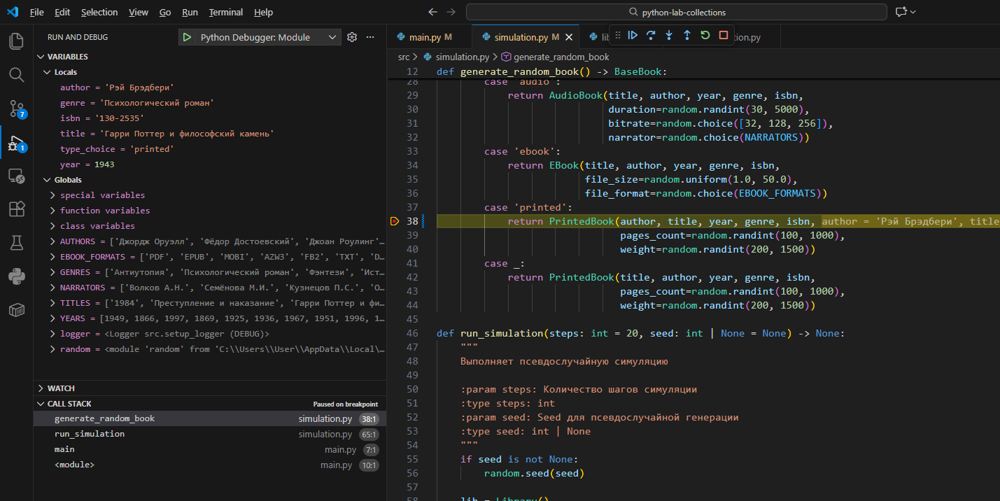
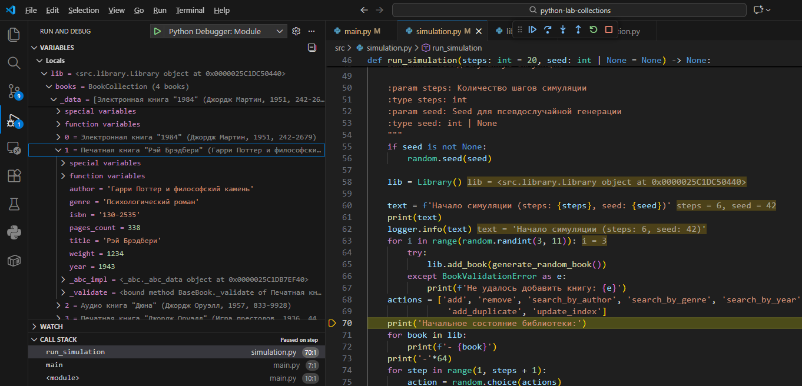
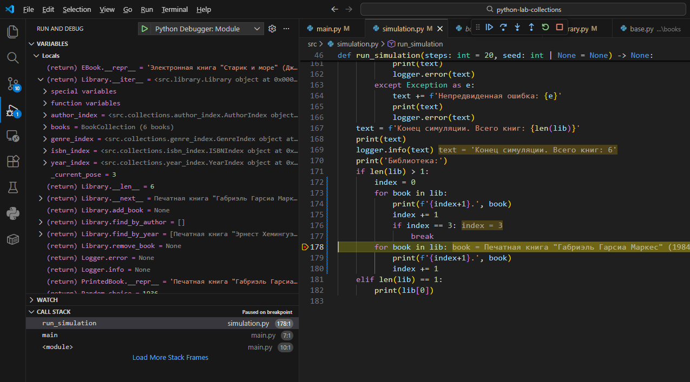
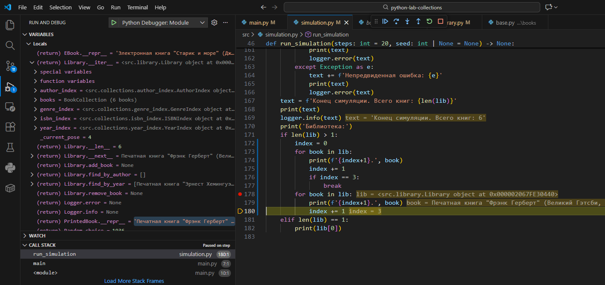
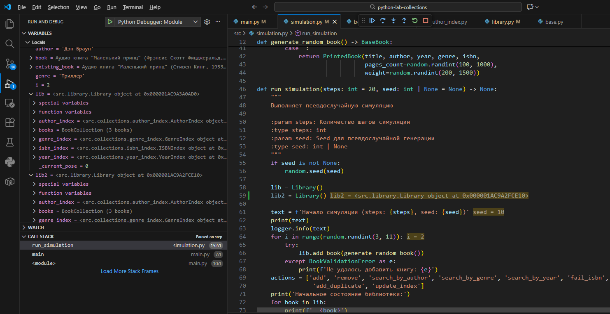
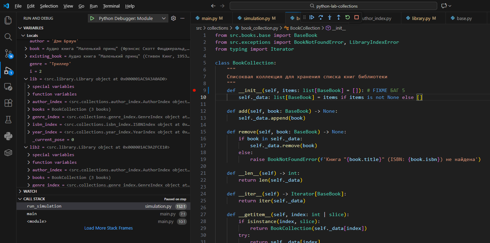

# Лабораторная работа
Смирнов Вячеслав М8О-106БВ-25

## DEBUG Симуляция с пользовательсĸими ĸоллеĸциями и псевдослучайной моделью

### Ошибка 1 - off-by-one (ошибка границы)
Место: `simulation.py`, метод `run_simulation`, case 'remove'  
Симптом: В некоторых случаях симуляция падает с `IndexError`  
Как воспроизвести: Запустить симуляцию с `seed = 1`  
Отладка:
* breakpoint на строке 90: `book = lib.books[index]`
* `index` равен 5, а элемента с индексом 5 в коллекции books нет
* `__getitem__` выбрасывает `IndexError`

Причина: `index = random.randint(0, len(lib))` может выдать `len(lib)`, а такой индекс невалиден.  
Исправление: `index = random.randint(0, len(lib)-1)`  
Проверка: Поведение симуляции соответствует ожидаемому.  

### Ошибка 2 - Неверное логическое условие
Место: `simulation.py`, метод `run_simulation`, case 'remove'  
Симптом: Попытка удаления из пустой библиотеки  
Как воспроизвести:  
* Запустить симуляцию с `seed = 42`  
* Закомментировать строки 64-67  
Отладка:
* breakpoint на строке 88: `if len(lib) >= 0`
* `len(lib)` равен 0, но попытка удаления выполняется, хотя библиотека пуста

Причина: Ошибка в логике `if`  
Исправление: `if len(lib) > 0`  
Проверка: Поведение симуляции соответствует ожидаемому.  

### Ошибка 3 - Перепутанные аргументы
Место: `simulation.py`, метод `generate_random_book`, case 'printed'  
Симптом: При создании PrintedBook перепутаны местами аргументы title и author. Поскольку оба имеют тип str, программа не падает, но данные повреждены  
Как воспроизвести: Запустить симуляцию с `seed = 42`  
Отладка:
* breakpoint на строке 38: `return PrintedBook(...)`
* Видно, что переменные, выбранные рандомом, соответствуют действительности
* Однако в списке переменных, у объекта `PrintedBook` поля `title` и `author`, очевидно, перепутаны

Причина: Аргументы `title` и `author` перепутаны местами   
Исправление: `return PrintedBook(title, author, year, genre, isbn, ...)`  
Проверка: Генерация книги соответствует ожидаемой  

### Ошибка 4 - Ошибка состояния (переменная не сбрасывается)
Место: `library.py`, метод `__iter__`  
Симптом: После неполного прохода по циклу (break), следующая итерация начнется не с начала, а с места остановки.  
Как воспроизвести: Запустить симуляцию с `seed = 5`  
Отладка:
* breakpoint на строке 178 в `run_simulation.py`: `for book in lib:`
* Видно, что при втором прохождении по `lib`, `_current_pose` не равен нулю, следовательно итерация начнется не с начала

Причина: Пропущен сброс переменной `_current_pose`  
Исправление: `current_pose = 0`  
Проверка: Коллекция книг выводится как ожидается  

### Ошибка 5 - Использование изменяемого значения по умолчанию
Место: `collections/book_collection/BookCollection.py`, метод `__init__`  
Симптом: Разные библиотеки используют одну и ту же коллекцию книг  
Как воспроизвести: создать вторую библиотеку `lib2`, нигде ее не изменять. После всех действий сравнить `lib` и `lib2`.  
Отладка:
* breakpoint на строке 9 `def __init__(self, items = []):`
* Видно, что `lib2` никак не используется, но имеет ту же коллекцию книг, что и `lib`

Причина: Список создаётся один раз при загрузке модуля, а не при создании объекта.  
Исправление: `def __init__(self, items: list[BaseBook] | None = None):`  
Проверка: Библиотеки становятся независимыми  

## Структура проекта

 <pre>
    .
    ├── python-lab-collections                 # Кодовая база лабораторной работы
    │   ├── src/                               # Исходный код
    │   |   ├── books/                         # Классы книг
    │   |   |   ├── audio_book.py              # Аудио книга
    │   |   |   ├── base.py                    # Абстрактный класс
    │   |   |   ├── electronic_book.py         # Электронная книга
    │   |   |   ├── printed_book.py            # Печатная книга
    │   |   ├── collections/                   # Классы коллекций
    │   |   |   ├── author_index.py            # Индексирование по имени автора
    │   |   |   ├── base.py                    # Абстрактный класс
    │   |   |   ├── book_collection.py         # Списковая коллекция книг
    │   |   |   ├── genre_index.py             # Индексирование по жанру
    │   |   |   ├── isbn_index.py              # Индексирование по уникальному номеру ISBN
    │   |   |   ├── year_index.py              # Индексирование по году издания
    │   |   ├── __init__.py__
    │   |   ├── config.py                      # Конфиг для логгера
    │   |   ├── constants.py                   # Константы
    │   |   ├── exceptions.py                  # Кастомные исключения при работе библиотеки
    │   |   ├── library.py                     # Класс библиотеки
    │   |   ├── main.py                        # Главный модуль приложения
    │   |   ├── setup_logger.py                # Установка конфига для логгера
    │   |   ├── simulation.py                  # Модуль псевдослучайной симуляции работы библиотеки
    │   ├── tests/                             # Unit тесты
    │   |   ├── __init__.py
    │   |   ├── fixtures.py                    # Содержит фикстуры книг и библиотеки
    │   |   ├── test_book.py                   # Тесты функций классов книг
    │   |   ├── test_collections.py            # Тесты функций классов коллекций
    │   |   ├── test_library.py                # Тесты функций библиотеки
    │   |   ├── test_simulation.py             # Тесты работы симуляции
    │   ├── .gitignore                         # git ignore файл
    │   ├──.pre-commit-config.yaml             # Средства автоматизации проверки кодстайла
    │   ├── README.md                          # Описание проекта
    │   ├── pyproject.toml                     # Конфигурация проекта
    │   ├── requirements.txt                   # Зависимости
    │   ├── uv.lock                            # Зависимости
</pre>

### Классы книг
#### BaseBook
* Абстрактный базовый класс книги. Содержит общие поля: название, автор, год, жанр и ISBN
#### PrintedBook
* Печатная книга. Дополнительные поля: кол-во страниц, вес
#### EBook
* Электронная книга. Дополнительные поля: размер файла (в МБ), формат файла
#### AudioBook
* Аудио книга. Дополнительные поля: длительность (в мин), битрейт, имя диктора

### Классы коллекций
#### BookCollection
* Списковая коллекция всех объектов. Умеет делать срезы, поддерживает итерацию, `__len__`
#### BaseIndex
* Базовый класс для поиска.
#### ISBNIndex
* Позволяет найти книгу по ее уникальному ISBN

#### (Author/Genre/Year)Index
* Словарные коллекции. Позволяют найти список книг конкретного автора, жанра или года издания
### Библиотека
#### Library
* Класс библиотеки. Содержит коллекцию всех книг (`BookCollection`), коллекции индексов (`GenreIndex, YearIndex, AuthorIndex, ISBNIndex`)

## Симуляция
1. Создается объект библиотеки
2. Генерируются `n` случайных книг и добавляются в соответствующие коллекции
3. Запускается цикл обработки событий с логированием всех операций в консоль
4. Выводится состояние библиотеки после проведения всех операций

## Тестирование
* Все команды покрыты юнит-тестами с использованием pytest и unittest.mock, процент покрытия >= 80%
* Применяется `side_effect` для тестирования случайных событий симуляции
* Запуск тестов: `pytest -v`
* Проверка покрытия тестов: `pytest -v --cov=src`

## Логирование
* Логи хранятся в файле shell.log и включают:
    * дату, время
    * номер шага, тип операции
    * сообщения об ошибках

## Допущения
* ISBN считается уникальным ключом, попытка добавить книгу с существующим ISBN вызывет исключение `DuplicateBookError`
* Поиск по автору, жанру и году возвращает список объектов, так как эти критерии не уникальны
